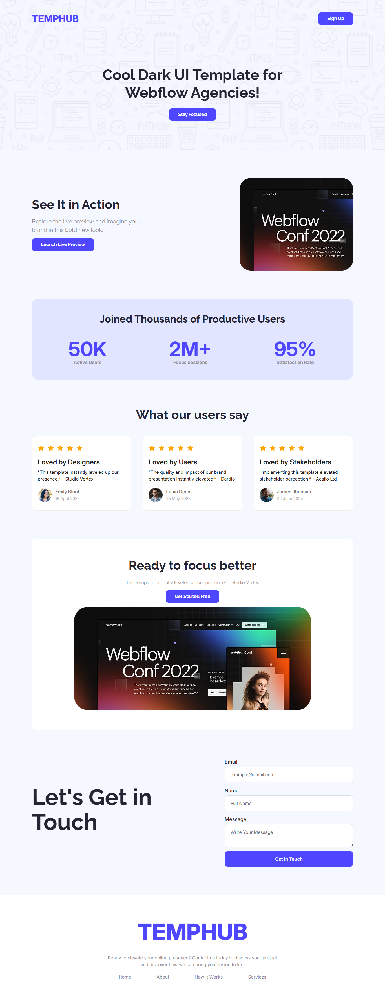

# TempHub - Elevate Brand Presence

It’s a specialized marketplace for agency-focused website templates, enabling agencies to discover and select their preferred designs and directly connect with the owners to complete the purchase.

## Table of Contents

- [Run it Locally](#run-it-locally)
- [Screenshots](#screenshots)
- [Necessary Links](#necessary-links)
- [Credit](#credit)

## Run it Locally

Please follow the below instructions to run this project in your machine:

1. Clone this repository

   ```sh
       git clone https://github.com/sagormajomder/A01-temphub.git
   ```

2. Open the directory "A01-temphub" into visual studio code and contribute
3. Install`live server` extension on vscode and run to see the project in browser

The project will be available on http://127.0.0.1:5500/ by default.

## Screenshots

### Desktop



## Necessary Links

- Repository link: [TempHub repository](https://github.com/sagormajomder/A01-temphub)
- App live link : [TempHub live](https://sagormajomder.github.io/A01-temphub/)

## Credit

This project is a assigment project and designed by [Programming Hero](https://github.com/ProgrammingHero1)
